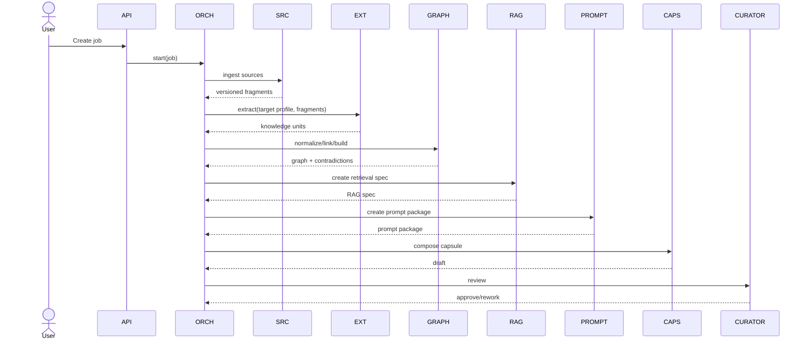
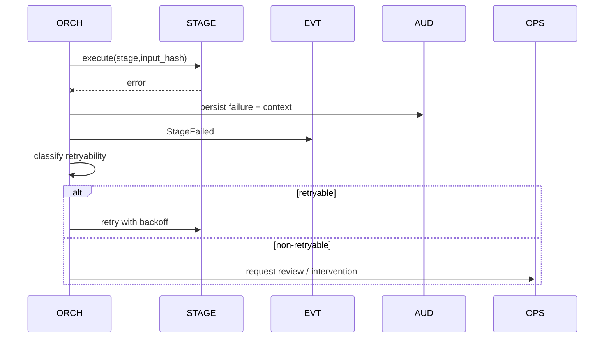

# AK-01 — Main Runtime Sequences

## Initial build

```mermaid
sequenceDiagram
    actor User
    participant API
    participant ORCH
    participant SRC
    participant EXT
    participant GRAPH
    participant RAG
    participant PROMPT
    participant CAPS
    participant CURATOR

    User->>API: Create job
    API->>ORCH: start(job)
    ORCH->>SRC: ingest sources
    SRC-->>ORCH: versioned fragments
    ORCH->>EXT: extract(target profile, fragments)
    EXT-->>ORCH: knowledge units
    ORCH->>GRAPH: normalize/link/build
    GRAPH-->>ORCH: graph + contradictions
    ORCH->>RAG: create retrieval spec
    RAG-->>ORCH: RAG spec
    ORCH->>PROMPT: create prompt package
    PROMPT-->>ORCH: prompt package
    ORCH->>CAPS: compose capsule
    CAPS-->>ORCH: draft
    ORCH->>CURATOR: review
    CURATOR-->>ORCH: approve/rework
```

## Recovery after failure

```mermaid
sequenceDiagram
    participant ORCH
    participant STAGE
    participant EVT
    participant AUD
    participant OPS

    ORCH->>STAGE: execute(stage,input_hash)
    STAGE--xORCH: error
    ORCH->>AUD: persist failure + context
    ORCH->>EVT: StageFailed
    ORCH->>ORCH: classify retryability
    alt retryable
        ORCH->>STAGE: retry with backoff
    else non-retryable
        ORCH->>OPS: request review / intervention
    end
```
