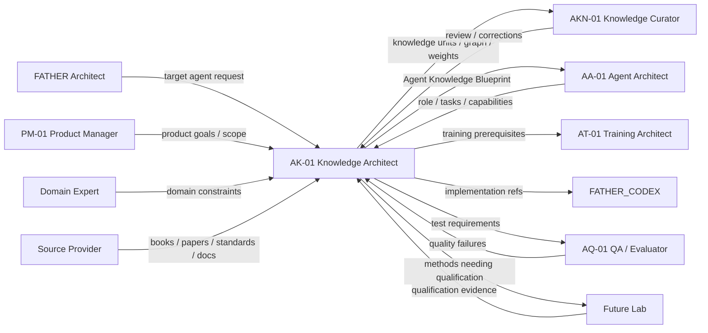

# AK-01 — Business Context Diagram

```mermaid
flowchart LR
    FA[FATHER Architect]
    PM[PM-01 Product Manager]
    AA[AA-01 Agent Architect]
    DE[Domain Expert]
    SP[Source Provider]
    AK[AK-01 Knowledge Architect]
    KC[AKN-01 Knowledge Curator]
    TA[AT-01 Training Architect]
    CODEX[FATHER_CODEX]
    QA[AQ-01 QA / Evaluator]
    FL[Future Lab]

    FA -->|target agent request| AK
    PM -->|product goals / scope| AK
    AA -->|role / tasks / capabilities| AK
    DE -->|domain constraints| AK
    SP -->|books / papers / standards / docs| AK

    AK -->|knowledge units / graph / weights| KC
    AK -->|Agent Knowledge Blueprint| AA
    AK -->|training prerequisites| TA
    AK -->|implementation refs| CODEX
    AK -->|test requirements| QA
    AK -->|methods needing qualification| FL

    KC -->|review / corrections| AK
    QA -->|quality failures| AK
    FL -->|qualification evidence| AK
```

## Interpretation
AK-01 is a central knowledge-engineering station, not the final authority on runtime qualification.
