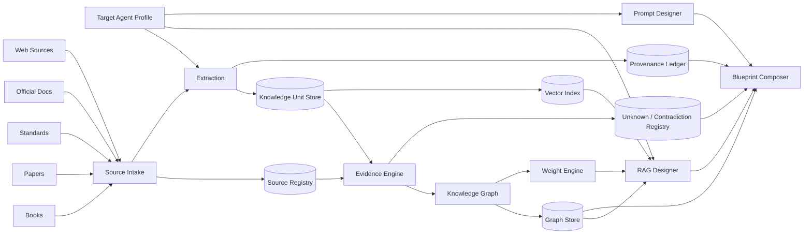

# AK-01 — Information / Data Flow

```mermaid
flowchart LR
    S1[Books]
    S2[Papers]
    S3[Standards]
    S4[Official Docs]
    S5[Web Sources]
    TP[Target Agent Profile]

    IN[Source Intake]
    EX[Extraction]
    EV[Evidence Engine]
    KG[Knowledge Graph]
    WE[Weight Engine]
    RG[RAG Designer]
    PG[Prompt Designer]
    BP[Blueprint Composer]

    SR[(Source Registry)]
    KU[(Knowledge Unit Store)]
    PR[(Provenance Ledger)]
    GR[(Graph Store)]
    VR[(Vector Index)]
    UR[(Unknown / Contradiction Registry)]

    S1 --> IN
    S2 --> IN
    S3 --> IN
    S4 --> IN
    S5 --> IN

    IN --> SR
    IN --> EX
    TP --> EX
    EX --> KU
    EX --> PR
    KU --> EV
    SR --> EV
    EV --> KG
    EV --> UR
    KG --> GR
    KG --> WE
    KU --> VR
    WE --> RG
    GR --> RG
    VR --> RG
    TP --> RG
    TP --> PG
    RG --> BP
    PG --> BP
    GR --> BP
    UR --> BP
    PR --> BP
```
