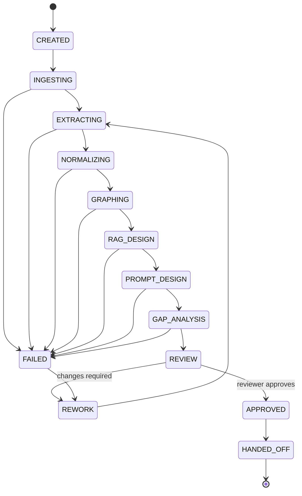
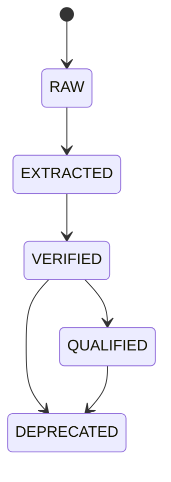

# AK-01 — Business State Model

## Knowledge Job states

```mermaid
stateDiagram-v2
    [*] --> CREATED
    CREATED --> INGESTING
    INGESTING --> EXTRACTING
    EXTRACTING --> NORMALIZING
    NORMALIZING --> GRAPHING
    GRAPHING --> RAG_DESIGN
    RAG_DESIGN --> PROMPT_DESIGN
    PROMPT_DESIGN --> GAP_ANALYSIS
    GAP_ANALYSIS --> REVIEW
    REVIEW --> REWORK: changes required
    REWORK --> EXTRACTING
    REVIEW --> APPROVED: reviewer approves
    APPROVED --> HANDED_OFF
    HANDED_OFF --> [*]

    INGESTING --> FAILED
    EXTRACTING --> FAILED
    NORMALIZING --> FAILED
    GRAPHING --> FAILED
    RAG_DESIGN --> FAILED
    PROMPT_DESIGN --> FAILED
    GAP_ANALYSIS --> FAILED

    FAILED --> REWORK
```

## Knowledge Unit states

```mermaid
stateDiagram-v2
    [*] --> RAW
    RAW --> EXTRACTED
    EXTRACTED --> VERIFIED
    VERIFIED --> QUALIFIED
    VERIFIED --> DEPRECATED
    QUALIFIED --> DEPRECATED
```

AK-01 may create RAW/EXTRACTED and support VERIFIED workflows.
AK-01 cannot independently promote to QUALIFIED.
