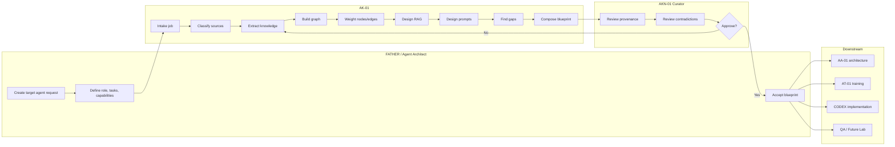

# AK-01 — BPMN-like Swimlane

```mermaid
flowchart LR
  subgraph ARCH[FATHER / Agent Architect]
    A1[Create target agent request]
    A2[Define role, tasks, capabilities]
    A3[Accept blueprint]
  end

  subgraph AK[AK-01]
    K1[Intake job]
    K2[Classify sources]
    K3[Extract knowledge]
    K4[Build graph]
    K5[Weight nodes/edges]
    K6[Design RAG]
    K7[Design prompts]
    K8[Find gaps]
    K9[Compose blueprint]
  end

  subgraph CUR[AKN-01 Curator]
    C1[Review provenance]
    C2[Review contradictions]
    C3{Approve?}
  end

  subgraph DOWN[Downstream]
    D1[AA-01 architecture]
    D2[AT-01 training]
    D3[CODEX implementation]
    D4[QA / Future Lab]
  end

  A1 --> A2 --> K1 --> K2 --> K3 --> K4 --> K5 --> K6 --> K7 --> K8 --> K9 --> C1 --> C2 --> C3
  C3 -->|No| K3
  C3 -->|Yes| A3
  A3 --> D1
  A3 --> D2
  A3 --> D3
  A3 --> D4
```
