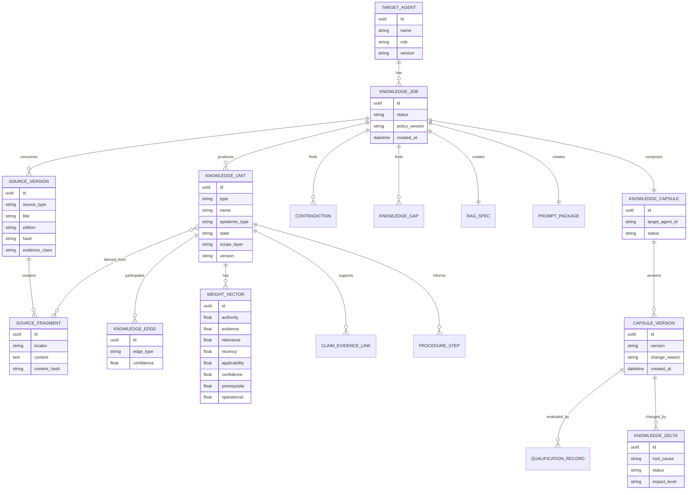

# AK-01 — Domain Data Model

```mermaid
erDiagram
    TARGET_AGENT ||--o{ KNOWLEDGE_JOB : has
    KNOWLEDGE_JOB ||--o{ SOURCE_VERSION : consumes
    SOURCE_VERSION ||--o{ SOURCE_FRAGMENT : contains
    KNOWLEDGE_JOB ||--o{ KNOWLEDGE_UNIT : produces
    KNOWLEDGE_UNIT }o--o{ SOURCE_FRAGMENT : derived_from
    KNOWLEDGE_UNIT ||--o{ KNOWLEDGE_EDGE : participates
    KNOWLEDGE_UNIT ||--o{ WEIGHT_VECTOR : has
    KNOWLEDGE_UNIT ||--o{ CLAIM_EVIDENCE_LINK : supports
    KNOWLEDGE_UNIT ||--o{ PROCEDURE_STEP : informs
    KNOWLEDGE_JOB ||--o{ CONTRADICTION : finds
    KNOWLEDGE_JOB ||--o{ KNOWLEDGE_GAP : finds
    KNOWLEDGE_JOB ||--|| RAG_SPEC : creates
    KNOWLEDGE_JOB ||--|| PROMPT_PACKAGE : creates
    KNOWLEDGE_JOB ||--|| KNOWLEDGE_CAPSULE : composes
    KNOWLEDGE_CAPSULE ||--o{ CAPSULE_VERSION : versions
    CAPSULE_VERSION ||--o{ QUALIFICATION_RECORD : evaluated_by
    CAPSULE_VERSION ||--o{ KNOWLEDGE_DELTA : changed_by

    TARGET_AGENT {
      uuid id
      string name
      string role
      string version
    }

    KNOWLEDGE_JOB {
      uuid id
      string status
      string policy_version
      datetime created_at
    }

    SOURCE_VERSION {
      uuid id
      string source_type
      string title
      string edition
      string hash
      string evidence_class
    }

    SOURCE_FRAGMENT {
      uuid id
      string locator
      text content
      string content_hash
    }

    KNOWLEDGE_UNIT {
      uuid id
      string type
      string name
      string epistemic_type
      string state
      string scope_layer
      string version
    }

    KNOWLEDGE_EDGE {
      uuid id
      string edge_type
      float confidence
    }

    WEIGHT_VECTOR {
      uuid id
      float authority
      float evidence
      float relevance
      float recency
      float applicability
      float confidence
      float prerequisite
      float operational
    }

    KNOWLEDGE_CAPSULE {
      uuid id
      string target_agent_id
      string status
    }

    CAPSULE_VERSION {
      uuid id
      string version
      string change_reason
      datetime created_at
    }

    KNOWLEDGE_DELTA {
      uuid id
      string root_cause
      string status
      string impact_level
    }
```

## Required scope layer values

CORE
DOMAIN
ORGANIZATION
PROJECT
ACTIVE_CONTEXT
