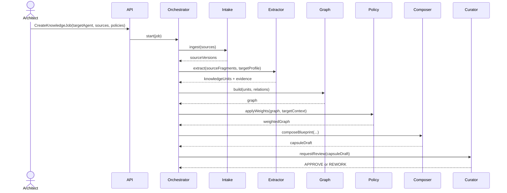
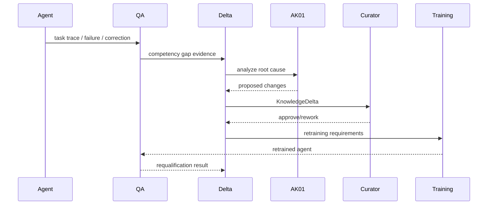

# AK-01 — Main Sequence Diagrams

## Initial capsule creation

```mermaid
sequenceDiagram
    actor Architect
    participant API
    participant Orchestrator
    participant Intake
    participant Extractor
    participant Graph
    participant Policy
    participant Composer
    participant Curator

    Architect->>API: CreateKnowledgeJob(targetAgent, sources, policies)
    API->>Orchestrator: start(job)
    Orchestrator->>Intake: ingest(sources)
    Intake-->>Orchestrator: sourceVersions
    Orchestrator->>Extractor: extract(sourceFragments, targetProfile)
    Extractor-->>Orchestrator: knowledgeUnits + evidence
    Orchestrator->>Graph: build(units, relations)
    Graph-->>Orchestrator: graph
    Orchestrator->>Policy: applyWeights(graph, targetContext)
    Policy-->>Orchestrator: weightedGraph
    Orchestrator->>Composer: composeBlueprint(...)
    Composer-->>Orchestrator: capsuleDraft
    Orchestrator->>Curator: requestReview(capsuleDraft)
    Curator-->>Orchestrator: APPROVE or REWORK
```

## Continuous correction

```mermaid
sequenceDiagram
    participant Agent
    participant QA
    participant Delta
    participant AK01
    participant Curator
    participant Training

    Agent->>QA: task trace / failure / correction
    QA->>Delta: competency gap evidence
    Delta->>AK01: analyze root cause
    AK01-->>Delta: proposed changes
    Delta->>Curator: KnowledgeDelta
    Curator-->>Delta: approve/rework
    Delta->>Training: retraining requirements
    Training-->>QA: retrained agent
    QA-->>Delta: requalification result
```
